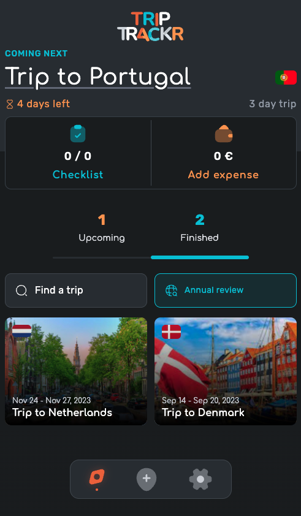
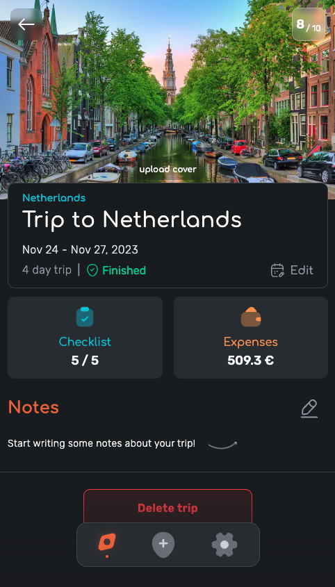
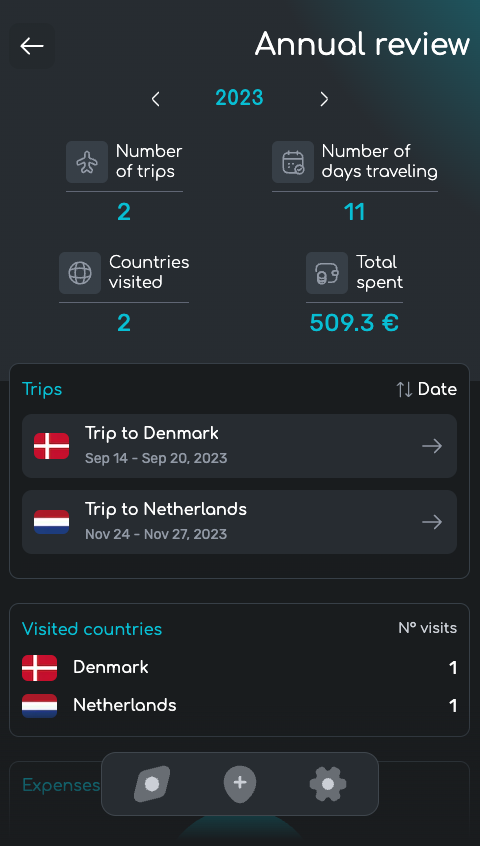

# Triptrackr

[](https://triptrackr.vercel.app/)
[](http://makeapullrequest.com)
[](http://www.firsttimersonly.com/)

# Introduction

#### This is essentially a companion for your trips. It will help you prepare for your trip by managing the items you have to take with you (checklist), and it will help you keep your expenses under control before and during the trip.

#### It also serves as a diary, where you can write down your thoughts and experiences during the trip, add a cover photo of a good memory made on that trip, give a rating and at any time, you can see all your finished and upcoming trips, search by country visited, review a full year of travel, and review the expenses for each trip.

<p align="center">
  
  
  
  
</p>


# Run it locally

```sh
  # Clone this repository
  $ git clone https://github.com/RicardoPBarbosa/triptrackr.git

  # Go into the repository
  $ cd triptrackr

  # Install dependencies
  $ bun i

  # Setup the environment variables
  # Configure supabase, cloudinary & google drive
  $ cp .env.example .env.local # and fill this with your own info

  # Run the app
  $ bun dev
```

# Supabase setup
### Tables SQL Dump
```sql
-- Trips
create table
  public.trips (
    id bigint generated by default as identity,
    title text not null,
    start_date date not null,
    end_date date not null,
    user_id uuid not null,
    country_id text not null,
    cover text null,
    rating smallint null,
    notes text null,
    created_at timestamp with time zone not null default now(),
    updated_at timestamp with time zone not null default now(),
    constraint trips_pkey primary key (id),
    constraint trips_user_id_fkey foreign key (user_id) references auth.users (id) on update cascade on delete cascade
  ) tablespace pg_default;

create trigger handle_updated_at before
update on trips for each row
execute function moddatetime ('updated_at');
```
```sql
-- Expenses
create table
  public.expenses (
    id bigint generated by default as identity,
    name text not null,
    date timestamp with time zone not null,
    amount real not null,
    payment_method public.payment_method not null,
    trip_id bigint not null,
    category_id text not null,
    created_at timestamp with time zone not null default now(),
    updated_at timestamp with time zone not null default now(),
    constraint expenses_pkey primary key (id),
    constraint expenses_trip_id_fkey foreign key (trip_id) references trips (id) on update cascade on delete cascade
  ) tablespace pg_default;

create trigger handle_updated_at before
update on expenses for each row
execute function moddatetime ('updated_at');
```
```sql
-- Checklist Templates
create table
  public.checklist_templates (
    id uuid not null default gen_random_uuid (),
    name text not null default ''::text,
    items text[] not null,
    user_id uuid not null default auth.uid (),
    created_at timestamp with time zone not null default now(),
    updated_at timestamp with time zone not null default now(),
    constraint checklist_templates_pkey primary key (id),
    constraint checklist_templates_user_id_fkey foreign key (user_id) references auth.users (id) on delete cascade
  ) tablespace pg_default;

create trigger handle_updated_at before
update on checklist_templates for each row
execute function moddatetime ('updated_at');
```
```sql
-- Checklists
create table
  public.checklists (
    items json[] not null,
    trip_id bigint not null,
    created_at timestamp with time zone not null default now(),
    updated_at timestamp with time zone not null default now(),
    constraint checklists_pkey primary key (trip_id),
    constraint checklists_trip_id_fkey foreign key (trip_id) references trips (id) on update cascade on delete cascade
  ) tablespace pg_default;

create trigger handle_updated_at before
update on checklists for each row
execute function moddatetime ('updated_at');
```
```sql
-- "Upcoming and Finished" View
create view
  public.upcoming_and_finished as
select
  trips.user_id,
  count(*) filter (
    where
      trips.end_date < now()
  ) as finished_trips,
  count(*) filter (
    where
      trips.start_date > now()
  ) as upcoming_trips
from
  trips
group by
  trips.user_id;
```

# Support

<a href="https://www.buymeacoffee.com/ricardopbarbosa"></a>

# License
MIT